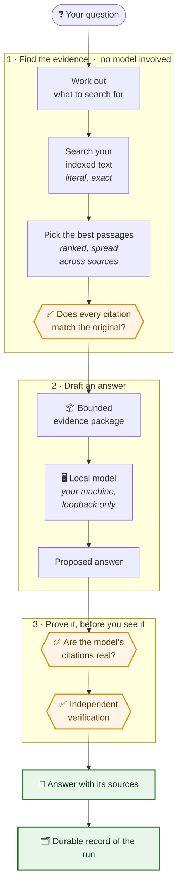
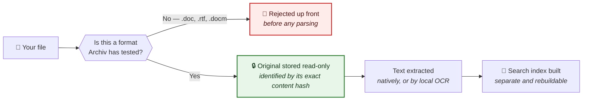

<div align="center">

# Archiv

**Your documents stay on your computer. Archiv makes them searchable — and answers
questions about them with sources you can check.**

[](LICENSE)
[](https://github.com/Nan0pk/Archiv/actions/workflows/fast-checks.yml)
[](pyproject.toml)
[](pyproject.toml)

*Early alpha. Tested on Fedora. Expect rough edges — but not invented answers.*

</div>

---

## The idea, in a minute

Most of us keep important documents in folders we can't really search. Contracts,
reports, scanned letters, spreadsheets, meeting notes. Finding the one paragraph you
half-remember means opening files one by one.

The usual fix is to upload everything to an online assistant. That works, but you hand
over your documents and you have to trust whatever answer comes back.

**Archiv is the other option.** You point it at a folder. It keeps every original file
exactly as it is, never modified, and builds a searchable index alongside. When you ask a
question, it finds the relevant passages, checks them against the untouched originals,
and shows you the answer *together with the page, sheet, slide, or line each part came
from*. If a language model is involved, it is one running on your own machine — nothing
leaves it.

> **Models propose. Validators decide whether work succeeded.**

In plain terms: nothing is reported as done until a separate, independent check confirms
it actually happened. If a citation doesn't hold up, you don't get shown it.

<details>
<summary><b>For engineers:</b> the five separated layers</summary>

<br>

Archiv keeps five concerns deliberately apart, so that a failure or a replacement in one
never silently corrupts another:

| Layer | What it is | Why it's separate |
| --- | --- | --- |
| **1. Canonical originals** | Immutable, content-addressed copies of your files | Evidence must never be rewritten by a later step |
| **2. Derived indexes** | Extraction output and the SQLite FTS5 search index | Rebuildable accelerators, safe to delete and regenerate |
| **3. Deterministic capabilities** | Bounded operations with declared reads, writes, and forbidden changes | Predictable, testable, no hidden effects |
| **4. Model-assisted reasoning** | Optional, opt-in, loopback-only | A model is a proposer, never an authority |
| **5. Validation and provenance** | Independent validators plus a durable run ledger | Success is decided by a checker, not by the thing being checked |

See [Architecture](docs/architecture.md), the
[execution contract](docs/execution-contract.md), and the decision record
[models propose, validators decide](docs/decisions/models-propose-validators-decide.md).

</details>

---

## What goes in, what comes out

<table>
<tr>
<th width="50%">📥 &nbsp; You give it</th>
<th width="50%">📤 &nbsp; You get back</th>
</tr>
<tr>
<td valign="top">

A folder of your own files:

- **Text and notes** — `.txt`, `.md`
- **PDFs** — including scanned ones
- **Word, Excel, PowerPoint** — `.docx`, `.xlsx`, `.pptx`
- **OpenDocument / LibreOffice** — `.odt`, `.ods`, `.odp`, `.odg`, and more
- **InPage Urdu documents** — `.inp`, read natively
- **Photos and scans** — `.png`, `.jpg`, read by local OCR
- **Audio** — `.wav`, catalogued but not transcribed

Nothing is uploaded. Nothing is altered.

</td>
<td valign="top">

Work you can actually use:

- **Exact matches** for a phrase, with verified locations — `archiv find`
- **A written answer** to a real question, with numbered sources — `archiv ask`
- **The precise spot** each source came from: page, sheet, cell, slide, line — `archiv source`
- **A finished Word report** with a citation appendix, checked by reopening it — `archiv report`
- **A preserved copy** of every original, stored read-only under its content hash — `archiv status`
- **A portable backup** of everything durable — `archiv backup`

</td>
</tr>
</table>

---

## How an answer gets made

This is the part worth understanding. An answer isn't a guess dressed up as a fact — it
passes through checkpoints, and any checkpoint can stop it.



The orange shapes are the checkpoints. They are why Archiv can show you a source and you can
trust that the source exists and says what the answer claims it says.

<details>
<summary><b>For engineers:</b> retrieval internals and how to inspect a decision</summary>

<br>

Query derivation is fully local: bounded query variants are built **without** a model,
embedding service, vector database, network call, or background daemon. Retrieval runs
literal FTS5 searches, merges with source diversity, applies a ranking and an evidence
limit, then validates citations against both the original and the normalized hashes
before anything is packaged for the model.

Add `--explain-retrieval` to any `ask` to see the exact terms derived, the concepts
recognized, the sources selected, the native locators, and the score and rank behind each
decision:

```bash
archiv ask "What remains unfinished?" --explain-retrieval
```

`archiv find` stays deliberately literal and predictable — it is not a ranked semantic
search and does not pretend to be.

`archiv source` accepts either a canonical object SHA-256 or one explicit citation drawn
from a JSON citation, a `find` result, an `ask` result, or a report manifest. It
revalidates the immutable original and the citation before returning a bounded,
read-only path inside Archiv-controlled storage. It does not permit arbitrary browsing or
execution.

Details: [Local search and citations](docs/search.md) ·
[Bounded source location](docs/source-location.md)

</details>

---

## What Archiv can do today

Version `0.1.0a6`. Every row below is implemented and tested — not planned.

| What you can do | What that means for you | Command |
| --- | --- | --- |
| **Add a folder** | Files are preserved unchanged and indexed for search in one step | `archiv add` |
| **Search exactly** | Literal matches with verified, checkable locations | `archiv find` |
| **Ask a question** | A written answer built only from your own documents | `archiv ask` |
| **See the reasoning** | The terms, sources, and scores behind the answer | `archiv ask --explain-retrieval` |
| **Go to the source** | One verified original, located without browsing or opening anything | `archiv source` |
| **Produce a report** | A cited Word document, reopened and validated before you're told it worked | `archiv report` |
| **Read Urdu InPage files** | `.inp` documents parsed natively into searchable text | `archiv ingest` |
| **Read scans and photos** | Local OCR for images and image-only PDF pages, with page and pixel-region citations | `archiv ingest` |
| **Measure your OCR** | A reproducible multilingual benchmark on generated fixtures | `archiv benchmark-ocr` |
| **Check the formats** | The tested compatibility matrix, straight from the source of truth | `archiv formats` |
| **Point at a local model** | Loopback-only setup for Ollama, LocalAI, or vLLM | `archiv model configure` |
| **Use a window instead** | A document-library desktop for ingesting, finding, asking, and reporting | `archiv ui` |
| **Check your environment** | A deterministic report on what's installed and working | `archiv doctor` |
| **Export safe diagnostics** | Preview an aggregate, redacted support bundle before saving | `archiv diagnostics-export support.json` |
| **Connect a workbench** | A bounded local MCP server, plus a pinned CoWork-OS integration | see [MCP docs](docs/mcp.md) |

Support and privacy guidance: [diagnostics and issue reports](docs/diagnostics.md) ·
[known issues](docs/known-issues.md) · [release notes](docs/release-notes.md).

### What Archiv does *not* claim

Being clear about limits is part of the point:

- **InPage layout is not reconstructed.** `.inp` text is extracted for search and
  grounding; page, frame, and layout reconstruction is explicitly outside the current
  claim.
- **`.odb` and `.wav` are catalogued, not read.** They are preserved and their details
  recorded, but no text is extracted from them.
- **OCR needs Tesseract installed.** If it's missing, or a requested language pack isn't
  present, Archiv skips cleanly — it will not fabricate text, and the preserved original
  stays valid.
- **No remote models.** Not a limitation to work around; a deliberate boundary. See
  [Privacy boundary](#privacy-boundary).

---

## Which files it handles



Unsupported formats are turned away **before** anything tries to parse them. They are
never quietly accepted and half-read.

| Family | Extensions | How text is read | A citation points to |
| --- | --- | --- | --- |
| Plain text | `.txt` `.md` | Natively | a line |
| PDF | `.pdf` | Natively | a page |
| Word | `.docx` | Natively | a paragraph |
| Spreadsheet | `.xlsx` | Natively | a sheet, or a cell |
| Presentation | `.pptx` | Natively | a shape on a slide |
| OpenDocument text | `.odt` `.ott` `.odm` `.otm` `.fodt` | Natively | a paragraph or heading |
| OpenDocument spreadsheet | `.ods` `.ots` `.fods` | Natively | a row and column, with formula |
| OpenDocument presentation | `.odp` `.otp` `.fodp` | Natively | an object on a slide |
| OpenDocument drawing | `.odg` `.otg` `.fodg` | Natively | an object on a page |
| OpenDocument formula | `.odf` | Natively | the formula |
| OpenDocument database | `.odb` | Details only | a named database object |
| InPage | `.inp` | Natively | a stream and byte offset |
| Images | `.png` `.jpg` `.jpeg` | Local OCR, if available | a pixel region on a page |
| Audio | `.wav` | Details only | — |

<details>
<summary><b>For engineers:</b> the authoritative matrix and its guarantees</summary>

<br>

The table above is a readable summary. The source of truth is
[`docs/format-compatibility.json`](docs/format-compatibility.json), validated against
[its schema](schemas/format-compatibility-matrix.schema.json) and re-verified by
`tests/test_format_matrix.py` against live local ingestion runs. Every family records its
detection method, immutable-ingestion status, extraction mode, structure, exact locator
shapes, macro policy, encryption handling, and known limits. Run `archiv formats` for the
installed version's view.

Notable specifics:

- **Detection fails closed.** Plain text requires bounded UTF-8 decoding; undecodable
  content fails rather than degrading. Malformed PDFs fail closed via `pypdf` structure
  parsing.
- **Content is never executed.** Macro-enabled formats are rejected by suffix, before
  parsing.
- **OCR segments are attributed.** Images and PDF pages without native text produce
  explicitly labelled `visual_ocr` segments carrying page, pixel region, engine,
  languages, and confidence — never mixed silently with native text.
- **Generated outputs are verified.** DOCX reports are reopened, structurally validated,
  citation-checked, and rendered through LibreOffice before success is reported; the
  report manifest pins the exact source evidence and the DOCX SHA-256.

Deeper reading: [Immutable ingestion](docs/ingestion.md) ·
[Native InPage ingestion](docs/inpage-ingestion.md) ·
[Local visual OCR](docs/visual-ocr.md) · [Cited DOCX reports](docs/reporting.md)

</details>

---

## Before you install

Archiv is tested on **Fedora**. Other Linux distributions may work but are not covered by
the acceptance runs.

You need **Python 3.12 or newer**. The installer also brings in a handful of system
packages, and it's worth knowing what each one is for:

| Package | What it enables | If it's missing |
| --- | --- | --- |
| `libreoffice-writer` | Rendering and validating Word and PDF reports | `archiv report` cannot complete its verification step |
| `tesseract` + `tesseract-langpack-eng`, `-ara`, `-urd` | Reading scans and photos in English, Arabic, and Urdu | Images ingest and are preserved, but produce no text |
| `python3-tkinter` | The desktop application | `archiv ui` won't open; every command still works in the terminal |
| `xdg-utils`, `bubblewrap` | Desktop integration and sandboxing | reduced integration |

---

## Install

**Recommended — read the script, then run it.** It's a shell script that installs
software on your machine; you should be able to see what it does first.

```bash
curl -fsSL https://raw.githubusercontent.com/Nan0pk/Archiv/main/tools/install-fedora.sh -o install-fedora.sh
less install-fedora.sh      # have a look
bash install-fedora.sh
```

**Or, in one line**, if you'd rather not:

```bash
curl -fsSL https://raw.githubusercontent.com/Nan0pk/Archiv/main/tools/install-fedora.sh | bash
```

Then confirm it worked:

```bash
archiv doctor
```

No cloning. No virtual environment to activate.

<details>
<summary><b>For engineers:</b> exactly what the installer does</summary>

<br>

The installer resolves `main` to one immutable commit, installs that exact source under
`~/.local/share/archiv-alpha/versions/`, records the commit and the downloaded archive
hash in `install.json`, and exposes `archiv` through `~/.local/bin`.

Useful flags: `--skip-system-packages` avoids running `dnf`, for prepared or
already-provisioned test environments. The script verifies `python3`, `curl`, and `tar`
are present and refuses to continue on an interpreter older than the required version.

See [User-ready Fedora alpha](docs/offline-alpha.md) and
[Hardware and performance notes](docs/hardware-and-performance.md).

</details>

---

## Your first ten minutes

You don't need documents of your own to try it — Archiv can generate a sample set.

**1. Make a sample folder to play with.**

```bash
archiv sample-vault "$HOME/Archiv-Sample"
```

**2. Add it.** Files are preserved and the search index is refreshed automatically.

```bash
archiv add "$HOME/Archiv-Sample"
```

**3. Find something.** Literal, exact matches with verified locations.

```bash
archiv find "unique fixture marker"
```

**4. Go to a source.** Save the matches, then ask where the first one lives. Archiv
re-verifies the original before telling you.

```bash
archiv find "unique fixture marker" --json > matches.json
archiv source --citation-file matches.json --citation-number 1
```

**5. Point Archiv at a model on your own machine.** Only needed for steps 6 and 7 —
searching works without one.

```bash
archiv model configure --endpoint http://127.0.0.1:11434 --model llama3
```

**6. Ask a real question.** Add `--explain-retrieval` to see how it decided.

```bash
archiv ask "What decisions were made and what remains unresolved?" --explain-retrieval
```

**7. Produce a report.** A cited Word document — reopened and validated before you're
told it succeeded.

```bash
archiv report "Prepare a cited status report with risks and next actions"
```

**8. Check on things, and back them up.**

```bash
archiv status
archiv backup "$HOME/archiv-backup.zip"
```

**Prefer a window to a terminal?** `archiv ui` opens a task-oriented document library.
Maintainers can open the retained command diagnostic with `archiv ui --diagnostic`.

---

## Every command

Most commands accept `--json` when you want machine-readable output instead of a
readable table.

#### Everyday use

| Command | What it does |
| --- | --- |
| `archiv add PATH` | Add supported files and refresh the search index in one step |
| `archiv find TEXT` | Find exact text, with independently validated citations |
| `archiv ask QUESTION` | Answer a question from your own documents, with sources |
| `archiv source` | Locate one verified original from a citation or object hash |
| `archiv report OBJECTIVE` | Generate a cited Word report and verify it before reporting success |
| `archiv status` | Show what's stored, indexed, and how ingestion went |
| `archiv ui` | Open the task-oriented document library |

#### Files and formats

| Command | What it does |
| --- | --- |
| `archiv ingest FILE` | Validate and ingest a single file into immutable storage |
| `archiv formats` | Show which formats are accepted and what is verified for each |
| `archiv benchmark-ocr` | Measure the installed Tesseract setup on generated local fixtures |
| `archiv rebuild-derived` | Rebuild one object's derived data from its original |
| `archiv rebuild-search-index` | Atomically rebuild the replaceable FTS5 index |
| `archiv search TEXT` | Search normalized text and emit validated exact citations |

#### Local model

| Command | What it does |
| --- | --- |
| `archiv model configure` | Configure a loopback-only OpenAI-compatible endpoint |
| `archiv model status` | Show the configured adapter's status |
| `archiv model show` | Show the exact persisted policy — absence means disabled |
| `archiv model test` | Test connectivity to the configured local server |
| `archiv model disable` | Turn local model integration off |

#### Keeping and moving your data

| Command | What it does |
| --- | --- |
| `archiv backup PATH` | Create a verified backup, excluding rebuildable indexes |
| `archiv export PATH` | Create a portable verified export of durable state |
| `archiv restore PATH` | Restore into an empty home and rebuild the search indexes |
| `archiv sample-vault PATH` | Create a deterministic synthetic vault to experiment with |

#### Tasks, checks, and reports

| Command | What it does |
| --- | --- |
| `archiv doctor` | Check the deterministic minimum environment |
| `archiv version` | Print the installed version |
| `archiv run` | Run one bounded deterministic task and record its evidence |
| `archiv verify RUN_ID` | Independently revalidate a prior task run |
| `archiv generate-report` | Generate a cited DOCX, reporting success only after validation |
| `archiv verify-report` | Verify a report's structure, citations, and rendering |
| `archiv source-marker` | Run and validate the exact source-marker task |

---

## Evidence it works

Claims in this README are backed by measured runs, not assertions.

**Field trial.** Against a frozen, public-safe corpus of 12 generated documents and 22
machine-readable questions spanning TXT, Markdown, PDF, DOCX, XLSX, and PPTX evidence,
Archiv retrieved every required source for **22 of 22 questions** at evidence limit 8,
with 22/22 structurally valid citation packages and **zero fabricated identifiers**.

These figures were measured on version `0.1.0a5`. The fixture deliberately isolates
retrieval, grounding, citation validation, completeness, honesty, reporting, and
source-location behaviour — it does **not** measure the quality of an arbitrary real
local model. Scope and limitations: [field-trial report](docs/field-trial-report.md) ·
[method](docs/field-trial.md).

**OCR baseline.** The local benchmark generates lawful synthetic English, Arabic, and
Urdu fixtures and records character and word error rates, runtime, memory, exact model
hashes, and failure cases — without touching your production configuration. See the
[measured baseline](docs/ocr-benchmark-report.md), the
[method](docs/ocr-benchmark.md), and the
[engine comparison](docs/ocr-engine-comparison.md).

---

## Privacy boundary

The model interface is bound to **explicit loopback-only HTTP endpoints** — something
running on your own machine, such as Ollama, LocalAI, or vLLM.

Remote hosts, cloud fallbacks, HTTPS tunnels, and embedded credentials are **rejected**.
Not discouraged — rejected. The only two settings the configuration accepts are *disabled*
and *loopback*; there is nothing to switch off.

If your local server needs a token, you give Archiv the *name of an environment variable*
to read it from — the secret itself is never written into Archiv's configuration.

---

## For developers

```bash
python -m venv .venv
source .venv/bin/activate
python -m pip install -e '.[dev]'
archiv doctor
pytest
```

Before opening a pull request, run the full check set:

```bash
ruff format --check .
ruff check .
pyright
pytest
```

Read [CONTRIBUTING.md](CONTRIBUTING.md) first. Every capability must declare what it
reads, what it writes, what it is forbidden to change, what evidence it emits, and which
independent validator decides success. Work proceeds through pull requests with
evidence-producing acceptance checks, against
[the definition of done](docs/definition-of-done.md).

**A hard rule about data.** Never commit private documents, personal data, credentials,
model keys, production databases, generated user archives, or proprietary test material.
Fixtures must be synthetic or explicitly redistributable. See the
[public repository policy](docs/public-repository-policy.md) and the
[GitHub governance and CI trust boundary](docs/github-governance.md).

Also: [Code of Conduct](CODE_OF_CONDUCT.md) ·
[Security policy](SECURITY.md) · [Roadmap](docs/roadmap.md)

---

<details>
<summary><b>📚 &nbsp;Full documentation index</b></summary>

<br>

**Design and principles**
- [Product charter](docs/product-charter.md)
- [Architecture](docs/architecture.md)
- [Execution contract](docs/execution-contract.md)
- [Models propose, validators decide](docs/decisions/models-propose-validators-decide.md)
- [Keep the workbench replaceable](docs/decisions/keep-the-workbench-replaceable.md)
- [Why Apache-2.0](docs/decisions/license-apache-2-0.md)

**Files, ingestion, and OCR**
- [Immutable ingestion](docs/ingestion.md)
- [Native InPage ingestion](docs/inpage-ingestion.md)
- [Local visual OCR](docs/visual-ocr.md)
- [OCR benchmark method](docs/ocr-benchmark.md)
- [Measured multilingual OCR baseline](docs/ocr-benchmark-report.md)
- [OCR engine comparison](docs/ocr-engine-comparison.md)
- [Tested format-compatibility matrix](docs/format-compatibility.json) ([schema](schemas/format-compatibility-matrix.schema.json))

**Search, citations, and evidence**
- [Local search and citations](docs/search.md)
- [Bounded source location](docs/source-location.md)
- [Real-work field-trial method](docs/field-trial.md)
- [Measured field-trial report](docs/field-trial-report.md)

**Output and integrations**
- [Cited DOCX reports](docs/reporting.md)
- [Bounded local MCP server](docs/mcp.md)
- [CoWork-OS integration](docs/cowork-os-integration.md)
- [Diagnostic console](docs/test-console.md)

**Running it**
- [User-ready Fedora alpha](docs/offline-alpha.md)
- [Hardware and performance notes](docs/hardware-and-performance.md)

**Process and governance**
- [GitHub governance and CI trust boundary](docs/github-governance.md)
- [Public repository policy](docs/public-repository-policy.md)
- [Definition of done](docs/definition-of-done.md)
- [Roadmap](docs/roadmap.md)

</details>

---

## Licence

Archiv is licensed under the [Apache License, Version 2.0](LICENSE). The comparison and
rationale — including why MIT, MPL-2.0, GPL-3.0, AGPL-3.0, and source-visible proprietary
were not selected — is recorded in
[docs/decisions/license-apache-2-0.md](docs/decisions/license-apache-2-0.md). Dependency
licences are not copied as Archiv's licence; third-party notices remain separate.
